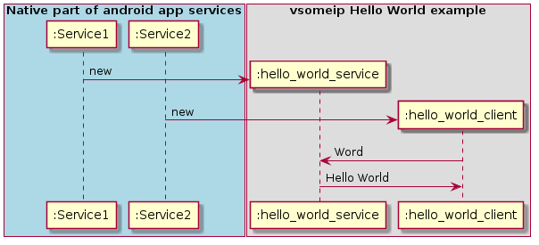

# ndk-vsomeip-hello-world
Android Studio example how to use vsomeip between two app services from native code.

Based on the original vsomeip example https://github.com/GENIVI/vsomeip/tree/master/examples/hello_world



## Environment
- Android Studio Dolphin | 2021.3.1
- CMake 3.18.1 (for boost-cmake-ndk)
- NDK r24

## Dependencies
Git submodule projects:
- vsomeip-ndk 3.3.8: (https://github.com/liurunjieuk/vsomeip-ndk.git).
- boost-cmake-ndk: Used CMake adapted boost (https://github.com/liurunjieuk/boost-cmake-ndk.git).

## Project setup
1. Clone main git project:
```
git clone https://github.com/nkh-lab/ndk-vsomeip-hello-world.git
```
2. Clone submodule projects:
```
git submodule update --init 
```

## Open project in Android Studio
1. Run Android Studio
2. Then open ndk-vsomeip-hello-world/vsomeip-hello-world project
3. Build and run
4. Expected app output in Logcat:
```
2020-06-05 11:13:06.407 31221-31266/com.example.vsomeiphelloworld I/hello_world_client: Sending: World
2020-06-05 11:13:06.437 31221-31266/com.example.vsomeiphelloworld I/hello_world_client: Received: Hello World
```
